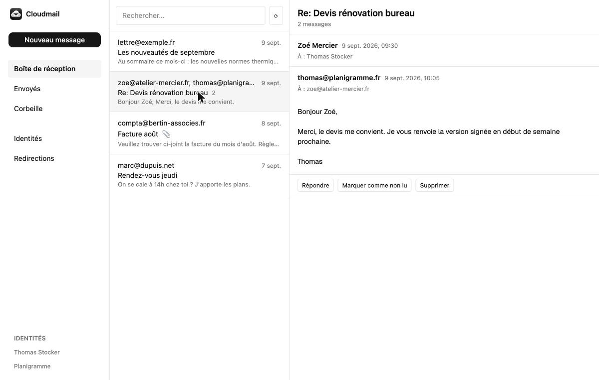

# Cloudmail

Personal webmail client, running entirely on a single Cloudflare Worker. Each
installation configures it with its own domain and its own sending identities
(see "Setup" below).



## Architecture

Cloudmail fits inside a single Cloudflare Worker that plays three roles at
once: the `email()` handler (exported from `src/email.ts`) receives incoming
messages via Email Routing and forwards them to the ingestion pipeline (MIME
parsing, storage, threading); an HTTP API built with Hono
(`src/api/routes.ts`) exposes read, reply, search and delete operations under
`/api/*`; and the same Worker serves the SPA's static files (the `ASSETS`
binding, built into `web/dist`) for every other route, with SPA fallback.
Structured metadata (identities, threads, messages, attachments) lives in a
D1 database; the raw MIME of each received message and attachment bodies are
stored in an R2 bucket. Cloudflare Access sits in front of the whole
application: no request reaches the API or the SPA without a valid Access
token (except in local development, see below).

Forwarding is managed from the application, not from the Cloudflare
dashboard. A rule in the D1 table `forward_rules` maps a source address — a
local part, or `*` for every address on the domain — to a destination
verified on the Cloudflare account. On receipt, `handleEmail`
(`src/email.ts`) applies **every** rule that matches the recipient, catch-all
included, and deduplicates identical destinations. The forward happens before
archiving, because `message.raw` is a single-use `ReadableStream`; the two
steps are isolated. What this isolation guarantees precisely: an
**exception** thrown by the forward or by reading the rules is caught and
does not prevent archiving, and a forward that **hangs** is abandoned after
ten seconds per destination (`FORWARD_TIMEOUT_MS` in `src/email.ts`) so that
archiving keeps execution time — without this bound, a forward that never
returns would leave the message with no R2 object and no D1 row, since
nothing has been written yet at that point. None of these situations calls
`setReject`. This separation is what allows a message to arrive both in
Cloudmail and in an external mailbox: Cloudflare Email Routing can only
deliver to a Worker **or** an address, never both.

## Never commit a value specific to your installation

Cloudmail is meant to be cloned and then deployed by other people. A value
that describes **one** installation therefore has no place in the
repository, even when it isn't secret. The criterion isn't "is it
confidential?" but **"does this value change from one installation to
another?"**.

An example that illustrates the nuance: the Cloudflare Access team domain and
your application's Application Audience (AUD) are **public** — Cloudflare
serves them to any anonymous visitor in the redirect to the login page, you
can read them with a plain `curl -I`. Yet they must not be versioned, because
they identify your installation and no one else's.

This includes: email addresses, domains and subdomains, account, D1
database, R2 bucket or DNS zone identifiers, Access team domain and AUD, and
of course any token or key.

**Where to put them instead.** Any value read by the Worker via `env` belongs
as a secret, which never goes through git:

```bash
pnpm wrangler secret put ACCESS_TEAM_DOMAIN
pnpm wrangler secret put ACCESS_AUD
pnpm wrangler secret put ALLOWED_EMAILS
```

In local development, copy `.dev.vars.example` to `.dev.vars` (gitignored)
and fill in the same variables there. If one is missing in production,
`requireAccessConfig()` (`src/auth/access.ts`) refuses every request with a
message naming it, instead of letting an opaque internal error through.

In tests and documentation, only use neutral example values
(`you@example.com`, `example.com`) — never a real address or domain.

**For what isn't read via `env`.** A route and a `database_id` are deployment
configuration: Wrangler reads them from its config file, so they can't be
secrets. The versioned `wrangler.jsonc` file only carries placeholders —
`mail.example.com`, `"local"`, `example.com` — and your real values live in a
`wrangler.overrides.json` at the repository root, gitignored:

```json
{
  "routes": [{ "pattern": "mail.yourdomain.com", "custom_domain": true }],
  "d1_databases": [{ "database_id": "<id shown by wrangler d1 create>" }],
  "vars": { "MAIL_DOMAIN": "yourdomain.com" }
}
```

`scripts/config.mjs` merges the two into `.wrangler/generated.jsonc`, which
deployment commands use via `-c`. `pnpm run deploy` and
`pnpm run migrate:remote` handle this on their own; `pnpm run config:check`
performs the same check without writing anything.

Two deliberate consequences of this design:

- **a fresh clone works with no setup** — the placeholders are structurally
  valid, so `pnpm test` and `pnpm dev` run immediately, with Miniflare
  simulating D1 and R2 without authentication;
- **it's impossible to accidentally deploy with the placeholders** —
  `scripts/config.mjs` refuses and names each missing value, rather than
  sending your Worker to a domain and database that aren't yours.

Overrides only replace what they mention, and array merging is done
element by element: specifying only `database_id` keeps the binding, the
database name and the migrations folder described by the versioned file.

## Cloudflare prerequisites

- A domain of your own (e.g. `example.com`) must be managed on Cloudflare
  (active DNS zone). The instructions below use `example.com` and the
  subdomain `mail.example.com` as examples: your real values go into
  `wrangler.overrides.json` and into secrets, never into a versioned file
  (see previous section).
- A **Workers Paid** plan is required to use Email Sending (the sending API
  used by `src/send/client.ts`). Email Routing, used for receiving, is free
  and doesn't require this plan.
- Cloudflare Access (Zero Trust) must be available on the account to protect
  the chosen subdomain (`mail.example.com` in the instructions).

## Environment variables

Summary of everything read by `src/env.ts` (`Env`), all required for a
complete deployment. Each row points to the "Setup" step that details how to
obtain the value; this table only gathers where each one is set.

| Variable | Kind | Where to set it when deployed | Where to set it locally | What it's for | Step |
| --- | --- | --- | --- | --- | --- |
| `CF_ACCOUNT_ID` | secret | `pnpm wrangler secret put CF_ACCOUNT_ID` | `.dev.vars` | Identifies the Cloudflare account in the URL called by `src/send/client.ts` (sending) | 8-9 |
| `CF_API_TOKEN` | secret | `pnpm wrangler secret put CF_API_TOKEN` | `.dev.vars` | Authenticates sending; dedicated token, **Email Sending: Send** permission only | 8-9 |
| `CF_ROUTING_TOKEN` | secret | `pnpm wrangler secret put CF_ROUTING_TOKEN` | `.dev.vars` | Authenticates reading verified destinations (`src/forwarding/destinations.ts`); **separate** token from the previous one, **Email Routing: Read** permission only | 8-9 |
| `ACCESS_TEAM_DOMAIN` | var | `wrangler.jsonc` → `vars` | — (not checked locally, see `DEV_BYPASS_AUTH`) | Cloudflare Access team domain, used by `src/auth/access.ts` to validate the JWT | 7 |
| `ACCESS_AUD` | var | `wrangler.jsonc` → `vars` | — | Access application Audience (AUD), same JWT check | 7 |
| `ALLOWED_EMAILS` | var | `wrangler.jsonc` → `vars` | — | Address(es) allowed to log in (application-side duplicate of the Access policy) | 7 |
| `MAIL_DOMAIN` | var | `wrangler.jsonc` → `vars` | — | Domain used to generate the `Message-ID` of sent emails (`src/api/routes.ts`) | 5 |
| `DEV_BYPASS_AUTH` | var, **local only** | never set when deployed | `.dev.vars` (`=1`) | Disables the Access check for local development; see the warning in `.dev.vars.example` | Local development |

Secrets (`CF_*`) are set once via `wrangler secret put` and can never be read
back afterwards — changing them means running the command again. Vars
(`ACCESS_*`, `ALLOWED_EMAILS`, `MAIL_DOMAIN`) are in plain text in
`wrangler.jsonc` and versioned with this repository: see the warning in
"Cloudflare prerequisites" about the three values to replace before any
deployment. The `DB` (D1), `MAIL` (R2) and `ASSETS` bindings aren't variables
but resources declared in `wrangler.jsonc` (step 1).

## Development commands

As defined in `package.json`:

- `pnpm dev` — runs `pnpm wrangler dev` (the Worker, with D1 and R2 simulated
  locally by Miniflare) and `pnpm --filter web dev` (the SPA's Vite dev
  server) in parallel.
- `pnpm test` — runs `vitest run` (247 tests on the Worker side: ingestion,
  API, auth, sending, forwarding) then `pnpm --filter web test` (51 tests on
  the SPA side).
- `pnpm build` — builds only the SPA (`pnpm --filter web build`), whose
  output (`web/dist`) is served by the Worker via the `ASSETS` binding.
- `pnpm run deploy` — generates the deployment configuration
  (`scripts/config.mjs`), rebuilds the SPA, then deploys the Worker (code +
  assets) to Cloudflare with that configuration. The `run` isn't optional
  here: in a pnpm workspace, `deploy` is a native pnpm command, so
  `pnpm deploy` fails with `ERR_PNPM_NOTHING_TO_DEPLOY` without ever running
  the script.
- `pnpm run config` — writes `.wrangler/generated.jsonc` by merging
  `wrangler.jsonc` and `wrangler.overrides.json`. `pnpm run config:check`
  performs the same check without writing anything, useful to make sure an
  installation is complete before deploying.
- `pnpm run migrate:remote` — applies D1 migrations to the remote database
  with the generated configuration.
- `pnpm typecheck` — `tsc --noEmit`, not required by the brief but useful
  locally.

## Setup

> **Migrations become immutable as soon as they're first applied.** As long
> as the remote database doesn't exist, `migrations/0001_initial.sql` can
> still be edited in place. After the first application (step 2 below), any
> schema change must go through a new `migrations/000N_*.sql` file: D1
> records already-applied migrations by name, so a later edit would never be
> replayed and the database would silently keep the old schema. If a
> **local** development database ends up in this state, resetting it is
> enough: `rm -rf .wrangler/state/v3/d1 .wrangler/state/v3/r2` then
> `pnpm wrangler d1 migrations apply cloudmail --local`.


These steps touch the user's paid Cloudflare account and make the service
public: they are **not** automated and must be run by hand, in order, by the
person operating the account.

The order matters, and not just for convenience: the D1 database is migrated
and seeded (steps 2 and 3) **before** any Email Routing setup (step 6). The
reverse order loses mail — a message arriving between enabling the catch-all
rule and applying migrations hits `no such table: messages`, the error is
swallowed by `handleEmail` (which never calls `setReject`, so as not to bounce
back to the sender), and the message only survives as an R2 object with no D1
row and no reverse index.

### 1. Create the D1 database and the R2 bucket

```bash
pnpm wrangler d1 create cloudmail
pnpm wrangler r2 bucket create cloudmail
```

The `d1 create` command prints a `database_id`. Then create, at the
repository root, a `wrangler.overrides.json` — gitignored — carrying your
three deployment values:

```json
{
  "routes": [{ "pattern": "mail.example.com", "custom_domain": true }],
  "d1_databases": [{ "database_id": "REPLACE_WITH_YOUR_ID" }],
  "vars": { "MAIL_DOMAIN": "example.com" }
}
```

Replacing `mail.example.com` with your own subdomain and `example.com` with
your domain (from step 5). Nothing else is needed: overrides only mention
what differs, and merging keeps the binding, database name and migrations
folder described by `wrangler.jsonc`.

If this step is skipped, nothing ships to your account: `scripts/config.mjs`
refuses to produce a configuration that still contains example values, and
names the ones that are missing. This is deliberate — deploying with the
placeholders would send the Worker to a domain and database that aren't
yours.

These values are only used remotely: locally, `wrangler dev` and the Vitest
tests read `wrangler.jsonc` with its placeholders, Miniflare simulating D1
and R2 without Cloudflare authentication. This is what lets a fresh clone
run `pnpm test` and `pnpm dev` with no setup at all.

### 2. Apply migrations remotely

```bash
pnpm run migrate:remote
```

This script generates the deployment configuration then runs
`wrangler d1 migrations apply cloudmail --remote -c .wrangler/generated.jsonc`.
The `-c` isn't decorative: without it, Wrangler would read the placeholder
`database_id` `"local"` from the versioned file instead of your real
database.

This step applies **every** migration in the `migrations/` folder: the
tables (`identities`, `threads`, `messages`, ...) from `0001_initial.sql`,
then the `forward_rules` table from `0002_forward_rules.sql`. It only
depends on step 1 (database created, `database_id` filled in): not on the
Worker, Access, or Email Routing. If it's skipped, every D1 query fails with
"no such table" — including those in the `email()` handler, whose failure is
silent.

**On an installation that's already deployed, this command must be re-run
before deploying this version.** D1 only applies migrations it hasn't
recorded yet, so re-running it on an up-to-date database costs nothing;
skipping it, on the other hand, breaks nothing visible — and that's exactly
the problem. Without `forward_rules`, `GET /api/forwarding/rules` returns
500 and the "Forwarding" view shows its error message instead of the list,
while every incoming message fails to read the rules: `handleEmail` logs
`forward_rules_failed` and archives normally. No mail is lost or rejected,
but no forwarding happens — the feature is silently absent, and stays that
way until the migration is applied.

### 3. Seed the `identities` table

```bash
pnpm wrangler d1 execute cloudmail --remote -c .wrangler/generated.jsonc --command \
  "INSERT INTO identities (address, display_name, is_default) VALUES ('you@example.com', 'Your Name', 1)"
```

Replace `you@example.com` and `Your Name` with the sending address and
display name you want, on your own domain — this is the name that will show
up to the recipient as the sender ("Your Name <you@example.com>" rather than
just the address).

This step creates the default sending identity; it needs the tables from
step 2. Without a row in `identities`, the API has no `From` address to
offer when composing or replying to a message, and `POST /api/messages`
refuses every send with `unknown_sender`. This is done in raw SQL only
because the Worker isn't deployed yet (step 4) and Access isn't configured
yet (step 7) — the "Identities" tab in the interface then handles any
additional identity, without going back through `wrangler d1 execute`.

### 4. First deployment (brings the Worker into existence)

```bash
pnpm run deploy
```

This first deployment has one purpose: to make the `cloudmail` Worker exist
on the Cloudflare account. It's needed here, before even Access and sending
secrets are configured, because step 6 (Email Routing) must pick this
Worker from a dropdown in the dashboard — and that list only offers
already-deployed Workers. Without this first deployment, step 6 is a dead
end: the list is empty and there's nothing to select.

This deployment only needs the bindings from step 1 (D1 database and R2
bucket already existing). At this point, the deployed Worker is incomplete
(sending secrets absent, `ACCESS_TEAM_DOMAIN`/`ACCESS_AUD` still empty):
that's normal and safe — with these variables empty, `requireAccess()`
rejects **every** API request with `401`, so nothing is exposed publicly
between this deployment and the final deployment in step 10. Its database,
though, is already migrated and seeded (steps 2-3): the Worker is
immediately able to ingest mail.

### 5. Verify the domain in Email Service

Cloudflare dashboard → Email → Email Service → Sending → add your domain
(`example.com`) and publish the requested DNS records (SPF/DKIM). Wait for
"verified" status.

Carry this same domain over to `wrangler.jsonc`, `vars` section →
`MAIL_DOMAIN` (used to generate the `Message-ID` of sent emails, see
`src/api/routes.ts`).

This step produces the authorization to send emails from your domain via
the Cloudflare Email Sending API. If it's skipped or incomplete, every send
through `src/send/client.ts` fails (the Cloudflare API rejects messages from
an unverified domain).

### 6. Enable Email Routing with a catch-all rule

Cloudflare dashboard → Email → Email Routing → enable, then create a
catch-all "Send to a Worker" rule pointing to the `cloudmail` Worker
(visible in the list thanks to the deployment in step 4).

This step produces the trigger for the `email()` handler (`src/email.ts`) on
every message received at `*@yourdomain`. If it's skipped, no incoming
message ever reaches Cloudmail: Cloudflare either rejects or drops them
depending on the MX DNS configuration in place.

This is the first step from which real mail can arrive: it therefore
requires everything ingestion needs to already exist — the deployed Worker
(step 4), the R2 bucket (step 1) and above all the D1 tables (step 2). This
is the reason for this step's position in the sequence.

**Watch out for literal rules already in place — but don't delete them
yet.** An Email Routing rule on a specific address takes precedence over the
catch-all: as long as it exists, the Worker never sees that address, and
Cloudmail archives nothing from it. If the domain already has forwarding
rules (for example `contact@` to a Gmail inbox), the Worker should indeed
take over their forward, in addition to archiving — but it isn't capable of
that yet. At this step, the "Forwarding" interface is unreachable and
unusable: the Access application doesn't exist yet (step 7), the
`CF_ROUTING_TOKEN` secret isn't set (step 9), and the Worker hasn't been
redeployed with these values (step 10), so the form can't list any verified
destination and no rule can be created. Deleting the literal rules here
would therefore open a window, lasting until step 10, during which
everything is archived but **nothing is forwarded** to the external
mailbox — exactly the regression that forwarding managed from Cloudmail
exists to avoid. The switch happens last: see "Taking over forwarding" at
the end of step 10.

Recreating a **catch-all** redirect to an external mailbox rather than named
rules also forwards all mail addressed to nonexistent addresses, which
Cloudflare currently drops. The choice is left to the user; named rules are
recommended.

### 7. Create the Cloudflare Access application

Zero Trust → Access → Applications → Self-hosted, domain `mail.example.com`
(the subdomain chosen in "Cloudflare prerequisites"), an "Emails" policy
limited to your own address (the one you'll log in with). Then copy the
Application Audience (AUD) and the team domain into `wrangler.jsonc`, `vars`
section:

```jsonc
"vars": {
  "ACCESS_TEAM_DOMAIN": "<team>.cloudflareaccess.com",
  "ACCESS_AUD": "<AUD copied from the Access application>",
  "ALLOWED_EMAILS": "you@example.com",
  "MAIL_DOMAIN": "example.com"
}
```

This step produces the access protection for `mail.example.com`: without a
valid Access token, `src/auth/access.ts` (`requireAccess()`) rejects every
API request with `401 unauthenticated`. If `ACCESS_TEAM_DOMAIN` or
`ACCESS_AUD` are left empty (their default value in `wrangler.jsonc`), JWT
verification fails systematically and no one — not even the legitimate
user — can log in. (These values only take effect at the final deployment,
step 10.)

### 8. Create the API tokens

Two separate tokens, each with a single permission:

- **Sending** — "Email Sending: Send" permission only. Used by
  `src/send/client.ts` to call
  `POST /accounts/{account_id}/email/sending/send`.
- **Routing** — "Email Routing: Read" permission only. Used by
  `src/forwarding/destinations.ts` to list the verified destinations the
  interface offers in the forwarding form.

Keeping them separate preserves least privilege: a leak of the sending
token doesn't grant access to routing configuration, and vice versa. An
overly permissive token would be an unnecessary risk; a missing or wrongly
scoped token makes the corresponding operation fail with a Cloudflare
authorization error.

### 9. Set the secrets

```bash
pnpm wrangler secret put CF_ACCOUNT_ID
pnpm wrangler secret put CF_API_TOKEN
pnpm wrangler secret put CF_ROUTING_TOKEN
```

These three commands produce the encrypted secrets read by the Worker:
`CF_ACCOUNT_ID` and `CF_API_TOKEN` by `src/send/client.ts` (sending),
`CF_ROUTING_TOKEN` by `src/forwarding/destinations.ts` (reading verified
destinations). Without the first two, any reply or send attempt fails
immediately; without the third, the forwarding form responds "Unable to
read verified destinations" and no rule can be created. They apply to the
Worker, which must therefore already exist (step 4).

### 10. Final deployment

```bash
pnpm run deploy
```

Second and last deployment: this time the Worker ships with the sending
secrets set (step 9), the `ACCESS_TEAM_DOMAIN`/`ACCESS_AUD` variables filled
in (step 7) and a migrated, seeded D1 database (steps 2-3). This run is what
makes the service actually usable in production; until it happens after the
previous steps, Access authentication and email sending remain
non-functional despite a Worker already online since step 4.

**Taking over forwarding (last).** It's only now that the "Forwarding"
interface is reachable and able to list the account's verified
destinations, so only now that the literal forwarding rules mentioned in
step 6 can be removed from Email Routing. In this order, and not the
reverse: first create in Cloudmail the redirect equivalent to each literal
rule (`contact@` to the same external mailbox, for example), then delete
the literal rules from the dashboard. As long as a literal rule exists, it
keeps delivering to the external mailbox and the Worker never sees the
address: the duplicate Cloudmail redirect created stays simply without
effect, and takes over the instant the literal rule disappears. No window
without forwarding ever opens. A test message sent to the address concerned
after the switch should arrive **both** in Cloudmail and in the external
mailbox; if it only arrives in Cloudmail, the corresponding rule is missing
or disabled, and the interface row shows the error from the last attempt.

## Replaying a message (`reparse`)

`src/email.ts` exports `reparse(env, rawKey, envelopeFrom)`, which re-reads
the raw MIME already stored in R2 (key `rawKey`), re-parses it, deletes the
corresponding existing D1 row (decrementing the original thread's counters
along the way) then calls `storeIncoming` again as if the message had just
arrived. This is the function to use to replay a message after a parser
fix, without having to get the original sender to resend the email.

**`reparse` doesn't replay forwarding.** It replays ingestion of an
already-stored message; re-forwarding at this point would send a duplicate
to external recipients, who already received their copy during the initial
receipt. A replay therefore fixes the D1 row and the indexed content, never
what has already gone out.

**No entry point is shipped today.** `reparse` isn't called anywhere in the
code: no API route, no script, no `wrangler` command. It exists and is
tested, but nothing in the deployed application lets you trigger it. To
invoke it anyway, you need to give yourself one temporarily:

1. Locally add, in `src/api/routes.ts`, an authenticated route (so going
   through `requireAccess()` like the others) that calls
   `reparse(c.env, rawKey, envelopeFrom)` with parameters supplied by the
   request or hardcoded for one-off use.
2. Run `pnpm wrangler dev --remote` so this local development Worker runs
   against the real **remote** D1/R2 bindings (and not against Miniflare's
   local simulations) — otherwise the replay would only touch ephemeral
   local data.
3. Trigger the route to perform the replay.
4. Remove the route added in step 1 before committing or redeploying.

**This route must never be deployed to production.** `reparse` deletes then
reinserts a `messages` row (and adjusts the affected thread's counters):
it's a destructive operation run with no confirmation or particular
safeguard beyond generic Access authentication. Exposing it durably on an
application reachable from the Internet deserves its own design and review
cycle, not a last-minute addition.

**Known limitation of `reparse` itself**: if the replayed message was the
only message in a thread, `storeIncoming` recreates a new thread for it
(threading is based on the normalized subject and reference headers at
re-parsing time, not on the old `thread_id`); the old thread, now empty,
stays orphaned in the database instead of being deleted. This case must be
cleaned up manually if needed.

## Raw MIME storage

A message's raw MIME R2 key is content-addressed:
`raw/<sha256-of-content>.eml`. It isn't generated from metadata (no
timestamp, no message identifier): two messages with identical bytes share
the same key. The corresponding D1 row (`messages` table) is the only known
address of that R2 object — there's no reverse index or listing that lets
you find a message from its R2 key without going through D1.

## R2 ↔ D1 reconciliation (finding orphans)

The project's strongest invariant is "no received message is ever lost": the
raw MIME is written to R2 **before** any parsing or D1 write. The corollary
is that a later failure (D1 insert rejected, database not yet migrated,
ingestion bug) leaves an R2 object with no `messages` row — and since there's
no reverse index (see previous section), nothing flags it. This procedure is
the only way to verify the invariant in production. It's manual and outside
the application: **no admin route is shipped, and this is deliberate** (a
route that lists or replays message content deserves its own design cycle,
not a last-minute addition).

**1. Extract known keys from D1.**

```bash
pnpm wrangler d1 execute cloudmail --remote -c .wrangler/generated.jsonc --json \
  --command "SELECT raw_key FROM messages ORDER BY raw_key" \
  | jq -r '.[0].results[].raw_key' | sort > d1-raw-keys.txt
```

**2. List the `raw/` prefix in R2.** Watch out: `wrangler r2 object` only
supports `get`, `put` and `delete` — **there's no listing subcommand**
(verified on wrangler 4.x). Listing therefore goes through R2's
S3-compatible API, with an R2 "Object Read" token (Access Key ID / Secret
Access Key created from R2 → Manage API tokens):

```bash
export AWS_ACCESS_KEY_ID=<R2 access key id>
export AWS_SECRET_ACCESS_KEY=<R2 secret access key>
export AWS_DEFAULT_REGION=auto

aws s3api list-objects-v2 \
  --endpoint-url "https://<CF_ACCOUNT_ID>.r2.cloudflarestorage.com" \
  --bucket cloudmail --prefix "raw/" \
  --query 'Contents[].Key' --output text \
  | tr '\t' '\n' | sort > r2-raw-keys.txt
```

(Failing `aws`, `rclone lsf` against an S3 remote pointing at the same
endpoint produces the same list; the R2 dashboard's object explorer lets you
browse the prefix by eye, which is enough on a small volume.)

**3. Compare the two lists.**

```bash
# Orphans: R2 object present, no D1 row — the case to handle.
comm -23 r2-raw-keys.txt d1-raw-keys.txt

# Reverse case: D1 row whose R2 object has disappeared (interrupted purge,
# see purgeMessage) — GET /api/messages/:id/raw returns 404 for these messages.
comm -13 r2-raw-keys.txt d1-raw-keys.txt
```

**4. Inspect an orphan**, to decide whether it's worth re-ingesting:

```bash
pnpm wrangler r2 object get cloudmail/raw/<sha256>.eml --remote --file orphan.eml
head -40 orphan.eml   # From, To, Subject, Message-ID
```

**5. Re-ingest.** `reparse(env, rawKey, envelopeFrom)` (see "Replaying a
message" above) re-reads exactly this object and replays the full
ingestion; it works just as well on an orphan — there's then simply no
existing D1 row to delete beforehand. Triggering it uses the temporary
route described in that same section, to be removed afterwards.

## Local development

Copy `.dev.vars.example` to `.dev.vars` (gitignored) to run `pnpm dev` with
`DEV_BYPASS_AUTH=1`, which disables the Cloudflare Access check locally. See
the warnings in `.dev.vars.example`: this variable must never be set
anywhere but locally.
